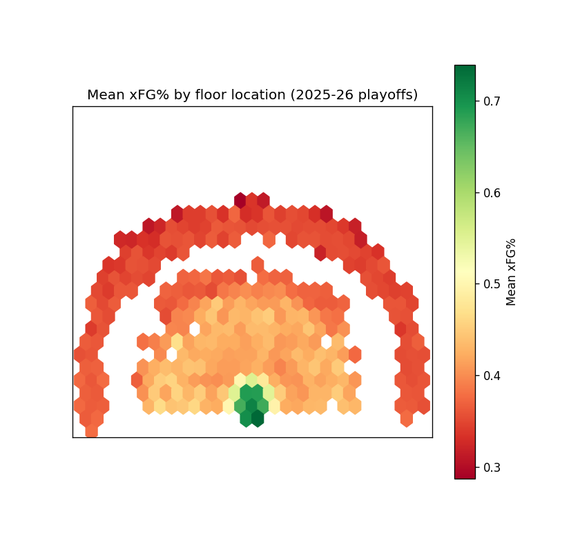
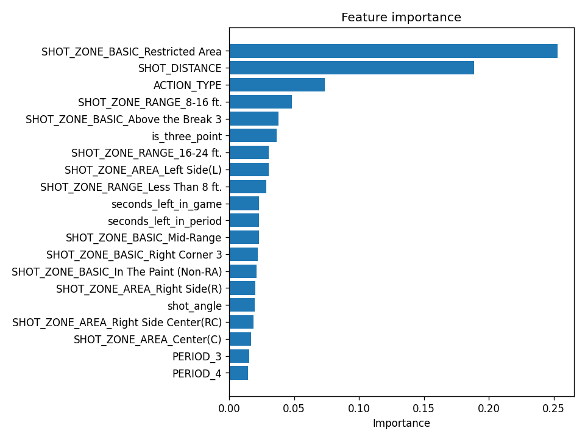
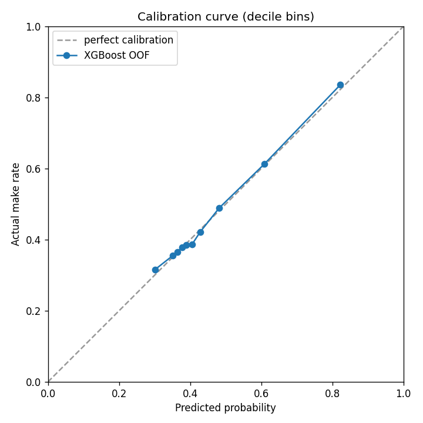
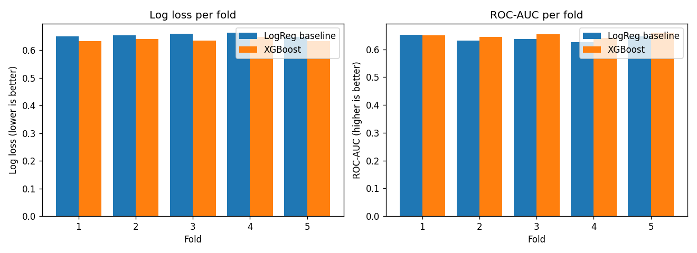
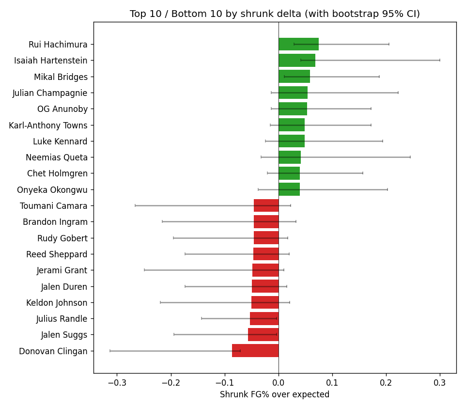

# Example run — 2025-26 playoffs (mid-bracket, 2026-05-11)

This is the actual output of `python scripts/run_pipeline.py` against the live
`nba_api` as of 2026-05-11. The bracket was not yet complete (16 of 30 teams had
playoff shots; the other 14 missed the playoffs or hadn't played yet), so sample
size is on the smaller end.

## Headline numbers

| Metric | LogReg baseline | XGBoost |
|---|---|---|
| Mean log loss (5-fold GroupKFold by GAME_ID) | **0.6546** | **0.6382** |
| Mean ROC-AUC | 0.639 | 0.650 |
| Mean Brier score | 0.231 | 0.224 |
| **XGBoost lift over baseline (log_loss)** | — | **+0.0164** |
| Max calibration decile deviation | — | 1.9% (under the 5% warning gate) |

- 10,503 shots, 62 games, 16 teams with playoff appearances
- XGBoost early-stopping picked best iterations of 51–59 per fold (well below the 500-tree budget)

## Top 10 / Bottom 10 — shrunk FG% over expected

Shrinkage pulls small-sample players toward zero. A player who took 25 shots and
got lucky on them won't dominate this list; their `weight` is small.

### Top 10

| Player | n shots | actual FG% | mean xFG% | raw Δ | **shrunk Δ** | bootstrap CI |
|---|--:|--:|--:|--:|--:|--|
| Rui Hachimura | 107 | 0.542 | 0.425 | +0.117 | **+0.075** | [+0.029, +0.206] |
| Isaiah Hartenstein | 37 | 0.784 | 0.613 | +0.171 | **+0.068** | [+0.042, +0.300] |
| Mikal Bridges | 91 | 0.593 | 0.496 | +0.097 | **+0.059** | [+0.011, +0.187] |
| Julian Champagnie | 62 | 0.516 | 0.407 | +0.109 | **+0.055** | [-0.013, +0.223] |
| OG Anunoby | 97 | 0.619 | 0.535 | +0.084 | **+0.053** | [-0.013, +0.172] |
| Karl-Anthony Towns | 92 | 0.587 | 0.506 | +0.081 | **+0.049** | [-0.015, +0.173] |
| Luke Kennard | 75 | 0.493 | 0.404 | +0.089 | **+0.049** | [-0.024, +0.194] |
| Neemias Queta | 34 | 0.735 | 0.630 | +0.106 | **+0.042** | [-0.032, +0.246] |
| Chet Holmgren | 86 | 0.593 | 0.526 | +0.067 | **+0.040** | [-0.021, +0.157] |
| Onyeka Okongwu | 48 | 0.583 | 0.496 | +0.087 | **+0.040** | [-0.037, +0.203] |

### Bottom 10

| Player | n shots | actual FG% | mean xFG% | raw Δ | **shrunk Δ** | bootstrap CI |
|---|--:|--:|--:|--:|--:|--|
| Donovan Clingan | 46 | 0.304 | 0.499 | -0.194 | **-0.086** | [-0.313, -0.071] |
| Jalen Suggs | 87 | 0.299 | 0.395 | -0.096 | **-0.057** | [-0.194, -0.004] |
| Julius Randle | 147 | 0.408 | 0.484 | -0.075 | **-0.053** | [-0.143, -0.003] |
| Keldon Johnson | 60 | 0.383 | 0.484 | -0.101 | **-0.050** | [-0.220, +0.021] |
| Jalen Duren | 79 | 0.494 | 0.579 | -0.085 | **-0.050** | [-0.174, +0.016] |
| Jerami Grant | 43 | 0.349 | 0.464 | -0.115 | **-0.048** | [-0.249, +0.010] |
| Reed Sheppard | 88 | 0.307 | 0.386 | -0.079 | **-0.046** | [-0.173, +0.020] |
| Rudy Gobert | 61 | 0.541 | 0.628 | -0.087 | **-0.046** | [-0.195, +0.018] |
| Brandon Ingram | 58 | 0.328 | 0.423 | -0.096 | **-0.046** | [-0.215, +0.033] |
| Toumani Camara | 38 | 0.289 | 0.409 | -0.120 | **-0.045** | [-0.266, +0.022] |

Sanity check: top has efficient role-player shooters and elite finishers (Hartenstein,
KAT, OG); bottom has rookies (Clingan, Sheppard), volume guards struggling on
high-difficulty shots (Randle, Suggs), and a non-shooting big getting low-quality
post looks (Gobert). All plausible.

## Visualizations

-  — mean xFG% by floor location. Corner-3 and at-rim hot; mid-range cold (as expected).
-  — XGBoost feature ranking.
-  — predicted vs actual make rate, decile bins.
-  — XGBoost vs LogReg, fold by fold.
-  — top 10 / bottom 10 shrunk Δ with bootstrap CI.

## Full ranking

[ranking.csv](ranking.csv) — every player with at least one playoff shot, sorted by
shrunk delta descending. Includes raw delta, shrinkage weight, and bootstrap CI.
